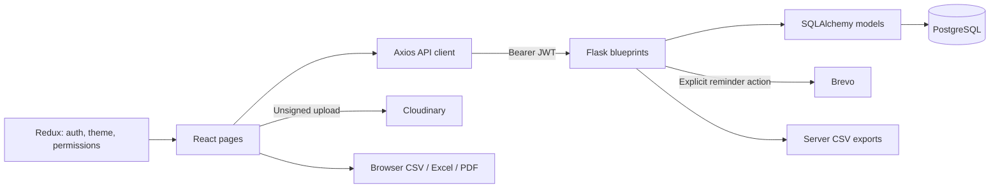
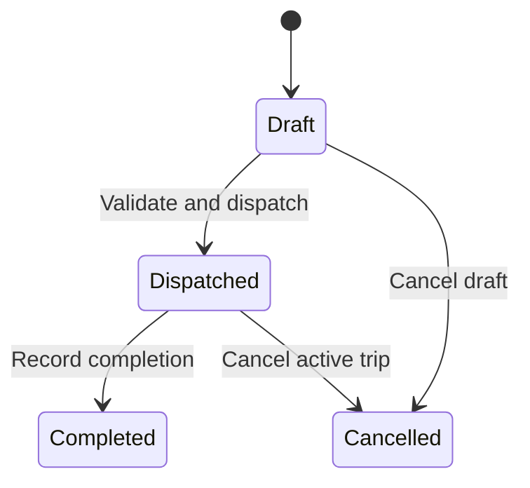

# transiti-fy

**A fleet operations workspace for vehicles, drivers, dispatch, maintenance, and transport costs.**

transiti-fy brings day-to-day transport records into a React dashboard backed by a Flask API and a relational database. Operators can register fleet assets, maintain driver records, create and dispatch trips, track maintenance, record fuel and expenses, and inspect cost and utilization metrics.

The central workflow connects operational records: dispatching a trip marks its vehicle and driver **On Trip**; completing it restores availability and updates the vehicle odometer. Maintenance records can move vehicles into and out of the **In Shop** state.

> **Status:** working development application with seeded demonstration data. Most operational endpoints are implemented, but authorization enforcement, concurrency handling, and some state transitions need further hardening. The configurable permission matrix currently governs much of the UI without being applied to most operational API routes. See [Known limitations](#known-limitations) before using real operational data.

## Contents

- [Capabilities](#capabilities)
- [Architecture](#architecture)
- [Quick start](#quick-start)
- [Configuration](#configuration)
- [Roles and account lifecycle](#roles-and-account-lifecycle)
- [Dispatch and maintenance workflows](#dispatch-and-maintenance-workflows)
- [Analytics definitions](#analytics-definitions)
- [API reference](#api-reference)
- [Exports and integrations](#exports-and-integrations)
- [Repository map](#repository-map)
- [Development and verification](#development-and-verification)
- [Known limitations](#known-limitations)
- [Troubleshooting](#troubleshooting)
- [License](#license)

## Capabilities

| Module | Implemented behavior |
| --- | --- |
| Dashboard | Vehicle availability/status counts, active and draft trips, drivers on duty, utilization, recent trips, and status distribution. |
| Fleet | Vehicle registration, editing, deletion checks, retirement/status controls, search/filtering, capacity, odometer, acquisition cost, region, and document URL. |
| Drivers | License/contact records, expiry validation, status changes, safety score, optional photo URL, and an explicit reminder action. |
| Trips | Draft creation, dispatch validation, completion, cancellation, linked vehicle/driver details, and CSV export. |
| Maintenance | Service records, costs, dates, completion actions, and vehicle availability updates. |
| Fuel and expenses | Fuel quantity/cost, tolls and other expenses, vehicle/trip references, and operational-cost aggregation. |
| Analytics | Fuel efficiency, utilization, operating cost, ROI-style ratios, monthly revenue, and costliest vehicles. |
| Settings | Depot/currency/distance labels, user provisioning, account status/role changes, and a persisted permission matrix. |
| Interface | Dark/light themes, navigation guards, guided product tour, charts, and CSV/Excel/PDF download helpers. |

Dashboard data is fetched through HTTP requests; there is no WebSocket feed, live GPS tracking, mapping service, route optimizer, or background dispatch engine.

## Architecture



| Layer | Stack |
| --- | --- |
| Frontend | React 19, React Router 7, Redux Toolkit, Axios |
| Interface | Tailwind CSS 4, Lucide/Heroicons, GSAP, Recharts |
| Build | Vite 8, npm lockfile, ESLint 10 |
| API | Flask application factory, Flask-CORS |
| Persistence | Flask-SQLAlchemy with PostgreSQL as the configured default |
| Authentication | Flask-JWT-Extended; Werkzeug password hashing |
| Optional services | Cloudinary uploads and Brevo email |
| Export | Browser CSV, SheetJS `xlsx`, jsPDF/AutoTable, backend CSV responses |

[`backend/app/__init__.py`](backend/app/__init__.py) initializes database/JWT/migration extensions and registers ten blueprints. Routes call SQLAlchemy models directly. The frontend's shared Axios instance attaches the stored access token and clears authentication on HTTP 401.

There is no committed migration directory or background worker. `seed.py` creates tables with `db.create_all()` and inserts demo records. Flask-Migrate is initialized, but schema upgrade history has not been supplied.

## Quick start

### Prerequisites

- Node.js **22.13+** as a setup baseline for the Vite 8 / ESLint 10 toolchain, with npm.
- Python **3.11+** as the documented backend setup baseline.
- A running PostgreSQL instance and a database user permitted to create application tables.
- Optional Cloudinary and Brevo accounts only if testing uploads or reminder delivery.

The repository does not define a full supported-runtime matrix or lock the Python dependency versions.

### 1. Clone

```bash
git clone https://github.com/quixoticalcoder/transiti-fy.git
cd transiti-fy
```

### 2. Prepare the database and backend

Create a development database using your PostgreSQL tools:

```sql
CREATE DATABASE transiti_fy;
```

Then:

```bash
cd backend
python3 -m venv .venv
source .venv/bin/activate
python -m pip install -r requirements.txt
cp .env.example .env
```

Set `DATABASE_URL`, `SECRET_KEY`, and `JWT_SECRET_KEY` in `.env`. Use your actual local PostgreSQL credentials. To create the schema and demonstration records in this development database:

```bash
python seed.py
python run.py
```

The API runs at `http://localhost:5000`. `run.py` loads `.env` before importing configuration. Its direct server invocation enables Flask debug mode, so use it for local development only.

On Windows PowerShell, create the environment with `py -3.11 -m venv .venv`, activate with `.\.venv\Scripts\Activate.ps1`, and copy the template with `Copy-Item .env.example .env`.

### 3. Start the client

In another terminal from the repository root:

```bash
cd client
npm ci
cp .env.example .env
npm run dev
```

Set `VITE_BASE_URL=http://localhost:5000` **without `/api`**; request paths already include that prefix. Open the Vite URL, normally `http://localhost:5173`.

### 4. Sign in with a seeded account

All seeded accounts use the local-demo password **`Password@123`**.

| Role | Active demo login |
| --- | --- |
| Fleet manager | `fleet.manager@transiti-fy.example` |
| Dispatcher | `dispatcher@transiti-fy.example` |
| Safety officer | `safety.officer@transiti-fy.example` |
| Financial analyst | `finance.analyst@transiti-fy.example` |

These reserved example-domain addresses identify local seed users; they are not delivery addresses. The seed also includes inactive/locked accounts and varied fleet states for UI demonstrations. Do not deploy the shared demo password or seed accounts as real operational accounts.

`python seed.py --reset` **drops all application tables** before recreating them. Use that option only for a disposable database. The normal seed path skips selected existing records; it is not a database migration or repair tool.

### 5. Verify connectivity

```bash
curl http://localhost:5000/api/health
```

Check the `database` field as well as the response status. The health route attempts `SELECT 1` but still returns HTTP 200 and `status: "ok"` when its database check fails.

## Configuration

### Backend (`backend/.env`)

| Variable | Purpose / default |
| --- | --- |
| `FLASK_ENV` | Selects development or production configuration; default `development`. |
| `DATABASE_URL` | SQLAlchemy connection URL; example database `transiti_fy`. |
| `SECRET_KEY` | Flask signing key; replace the development fallback. |
| `JWT_SECRET_KEY` | Signing key for both access and refresh JWTs. |
| `JWT_ACCESS_TOKEN_EXPIRES_MINUTES` | Access-token lifetime, default 60 minutes. |
| `JWT_REFRESH_TOKEN_EXPIRES_DAYS` | Refresh-token lifetime, default 7 days. |
| `FRONTEND_URL` | Allowed frontend CORS origin, default `http://localhost:5173`. |
| `CLOUDINARY_CLOUD_NAME`, `CLOUDINARY_API_KEY`, `CLOUDINARY_API_SECRET` | Server-side Cloudinary helper configuration. |
| `BREVO_API_KEY` | Credential for transactional email requests. |
| `BREVO_SENDER_EMAIL`, `BREVO_SENDER_NAME` | Sender identity; use a verified real sender before testing delivery. |

There is no separate `JWT_REFRESH_SECRET` setting. The server's Cloudinary helper reads individual credential fields rather than a documented `CLOUDINARY_URL` setting.

### Frontend (`client/.env`)

| Variable | Purpose |
| --- | --- |
| `VITE_BASE_URL` | Backend origin, e.g. `http://localhost:5000`. |
| `VITE_CLOUDINARY_CLOUD_NAME` | Cloudinary cloud used by direct browser uploads. |
| `VITE_CLOUDINARY_UPLOAD_PRESET` | Unsigned upload preset configured in Cloudinary. |

Only public configuration belongs in `VITE_*` values. The Cloudinary API secret, Brevo key, and JWT signing key must remain on the server.

### Existing installations after naming cleanup

The displayed project name is `transiti-fy`; underscore-based identifiers use `transiti_fy`. Existing database contents are not renamed: preserve your current `DATABASE_URL` explicitly if retaining an existing database. Existing users retain their stored email addresses; the new `.example` addresses apply to newly inserted demo accounts. The renamed local-storage keys reset browser login, theme, and tour preferences. Cloudinary assets in existing folders are not moved.

## Roles and account lifecycle

There is **no public self-registration**. Fleet managers create users from Settings through the protected `/api/auth/register` endpoint. Fleet managers can list users and change another account's role/active state; self-demotion and self-deactivation are blocked by that update route.

| Role | Intended responsibility |
| --- | --- |
| `fleet_manager` | Administrative settings, account provisioning, fleet oversight. |
| `dispatcher` | Trip creation, assignment, and dispatch. |
| `safety_officer` | Driver records and compliance review. |
| `financial_analyst` | Expenses and analytics. |

The permission matrix stores `No Access`, `View Only`, or `Full Access` for Fleet, Drivers, Trips, Fuel & Expenses, and Analytics. Frontend hooks use this matrix to control navigation/actions. Settings and account-administration mutations enforce the fleet-manager role on the server. **Most operational endpoints only enforce JWT presence**, so a hidden UI action is not a server-side authorization boundary.

Login locks an account after five failed password attempts. Successful login resets the counter. Access tokens carry role/name claims; refresh reuses those claims without rechecking the current user record. Deactivation or role changes do not revoke already-issued tokens. The frontend stores tokens in local storage and logs out on 401 rather than automatically refreshing them.

## Dispatch and maintenance workflows

### Trip state machine



Creation requires `source`, `destination`, `cargo_weight_kg`, and `planned_distance_km`. Vehicle and driver IDs are optional at creation, but both are required at dispatch. There is no general trip-update route to attach missing assignments later, so API clients should create dispatchable drafts with both IDs.

The creation path rejects unavailable assigned resources, an expired driver license, and over-capacity cargo. Dispatch checks current resource states again, rejects retired/in-shop/on-trip vehicles, suspended/on-trip or expired drivers, and excess cargo, then marks both resources **On Trip**.

Completion accepts `actual_distance_km`, `fuel_consumed_liters`, and optional `revenue`. Distance defaults to the planned distance if omitted. The route restores availability and increments the vehicle odometer. Cancelling a dispatched trip restores resources that remain **On Trip**; cancelling a draft does not change resource status.

These checks are application-level validations. Dispatch does not lock resource rows to prevent concurrent assignments, and its driver-state check does not explicitly reject **Off Duty** if that state changed after drafting. The stored ETA is the dispatch timestamp, not a calculated arrival prediction.

### Maintenance

Creating a record with `In Shop` status moves the linked vehicle into the shop; creation is blocked for a vehicle currently on a trip. Completing a record restores **Available** unless the vehicle is **Retired**.

This is a basic status workflow, not a full maintenance scheduler. Multiple open jobs, manual status updates, and deletion can leave inconsistent vehicle states. For example, closing one job can restore availability while another remains open; deleting an open job does not itself restore the vehicle.

## Analytics definitions

The formulas are implemented in [`backend/app/routes/analytics.py`](backend/app/routes/analytics.py). They operate on stored records, generally across all time.

| Metric | Calculation / interpretation |
| --- | --- |
| Fuel efficiency | Sum of actual distance on completed trips ÷ sum of liters across fuel logs. Zero when no fuel is recorded. |
| Fleet utilization | Vehicles currently On Trip ÷ non-retired vehicles × 100. In-shop vehicles remain in the denominator. |
| Operational cost | Fuel cost + maintenance cost + toll charges + other expenses. |
| Fleet ROI-style ratio | (Completed-trip revenue − maintenance cost − fuel cost) ÷ total vehicle acquisition cost × 100. |
| Vehicle ROI-style ratio | The same revenue/fuel/maintenance calculation scoped to a vehicle. |
| Monthly revenue | Revenue from completed trips grouped by each trip's `updated_at` month. |
| Costliest vehicles | Fuel + maintenance + toll/other expense totals per vehicle, ranked descending. |

The ROI ratios exclude tolls/other expenses and substitute a denominator of 1 when acquisition cost is zero. They are implemented indicators, not complete accounting profit or investment-return measures. Fuel logs and completed trips need consistent coverage for efficiency to be meaningful. Changing currency or distance settings does not implement a historical unit-conversion pipeline.

## API reference

Base URL: `http://localhost:5000`. Except login and health, routes require a bearer token; refresh specifically requires a refresh token. Most responses are JSON; export endpoints return CSV.

| Area | Routes |
| --- | --- |
| Health | `GET /api/health` |
| Authentication | `POST /api/auth/login`, `POST /api/auth/refresh`, `GET /api/auth/me` |
| Admin users | `POST /api/auth/register`, `GET /api/auth/users`, `PATCH /api/auth/users/<id>` |
| Vehicles | `GET/POST /api/vehicles`, `GET/PUT/DELETE /api/vehicles/<id>`, `GET /api/vehicles/dispatch-pool`, `GET /api/vehicles/export` |
| Drivers | `GET/POST /api/drivers`, `GET/PUT/DELETE /api/drivers/<id>`, `PATCH /api/drivers/<id>/status`, `GET /api/drivers/dispatch-pool`, `GET /api/drivers/export` |
| Driver reminders | `POST /api/drivers/<id>/send-reminder` |
| Trips | `GET/POST /api/trips`, `GET /api/trips/<id>`, `POST /api/trips/<id>/dispatch`, `/complete`, `/cancel`, `GET /api/trips/export` |
| Maintenance | `GET/POST /api/maintenance`, `GET/PUT/DELETE /api/maintenance/<id>`, `POST /api/maintenance/<id>/complete`, `GET /api/maintenance/export` |
| Fuel | `GET/POST /api/fuel-logs`, `DELETE /api/fuel-logs/<id>`, `GET /api/fuel-logs/export` |
| Expenses | `GET/POST /api/expenses`, `DELETE /api/expenses/<id>`, `GET /api/expenses/export`, `GET /api/operational-cost` |
| Dashboard | `GET /api/dashboard/kpis`, `/recent-trips`, `/vehicle-status-distribution` |
| Analytics | `GET /api/analytics/summary`, `/monthly-revenue`, `/top-costliest-vehicles`, `/vehicle-roi/<id>` |
| Settings | `GET/PUT /api/settings/general`, `GET/PUT /api/settings/rbac` |

The shortened paths in a row use the same prefix as its first route. For example, trip completion is `POST /api/trips/<id>/complete`.

### Authenticate and inspect vehicles

```bash
curl -X POST http://localhost:5000/api/auth/login \
  -H 'Content-Type: application/json' \
  -d '{"email":"fleet.manager@transiti-fy.example","password":"Password@123"}'
```

The response includes `access_token`, `refresh_token`, and `user`. Set `TRANSITI_TOKEN` in your terminal to the returned access token, then:

```bash
curl http://localhost:5000/api/vehicles \
  -H "Authorization: Bearer ${TRANSITI_TOKEN}"
```

### Create a dispatch-ready draft

Use IDs returned by the dispatch-pool endpoints. The following IDs are illustrative; do not assume seeded record 1 is available.

```bash
curl -X POST http://localhost:5000/api/trips \
  -H "Authorization: Bearer ${TRANSITI_TOKEN}" \
  -H 'Content-Type: application/json' \
  -d '{
    "source":"Ahmedabad",
    "destination":"Vadodara",
    "vehicle_id":1,
    "driver_id":1,
    "cargo_weight_kg":450,
    "planned_distance_km":110,
    "revenue":5000
  }'
```

Call `/api/trips/<returned-id>/dispatch` after reviewing the draft. Expected validation failures typically use HTTP 400, missing records use 404, and duplicates can use 409. Validation is not uniform across endpoints, so malformed numeric/date inputs can still produce unhandled errors.

## Exports and integrations

**Exports.** Backend `/export` routes serialize all records for their module rather than automatically adopting list filters. Browser export buttons use their supplied row arrays to generate CSV, Excel, or tabular PDF downloads. The browser CSV helper uses JSON string escaping, which does not correctly represent every CSV field containing quotes/newlines; validate complex exported data before reuse.

**Cloudinary.** The frontend uploads directly with an unsigned preset and stores returned URLs in vehicle/driver records. Configure suitable upload restrictions in that preset. A separate server helper exists, but its presence is not a complete authenticated upload API.

**Brevo.** Driver reminders are triggered through an explicit API action. They require a recipient email and configured sender/key. There is no scheduled reminder worker. The default `.example` sender is a placeholder that must be replaced with a verified sending identity.

## Repository map

```text
transiti-fy/
├── backend/
│   ├── app/
│   │   ├── __init__.py           Flask factory and blueprint registration
│   │   ├── config.py             Environment-backed configuration
│   │   ├── extensions.py         SQLAlchemy, JWT, Flask-Migrate
│   │   ├── models/               Users, vehicles, drivers, trips, costs, settings
│   │   ├── routes/               API modules
│   │   └── utils/                RBAC, CSV, Cloudinary, Brevo helpers
│   ├── run.py                    Development entry point and dotenv loading
│   ├── seed.py                   Schema creation and demo data
│   ├── requirements.txt          Unpinned Python dependencies
│   └── .env.example
├── client/
│   ├── src/
│   │   ├── pages/                Dashboard, fleet, drivers, trips, costs, settings
│   │   ├── components/           UI controls, exports, route guard, product tour
│   │   ├── layout/               Shared application shell
│   │   ├── configs/              API and Cloudinary clients
│   │   ├── store/                Redux auth, permissions, and theme slices
│   │   ├── hooks/                Permission lookup
│   │   └── lib/                  Formatting, animation, export utilities
│   ├── package.json
│   ├── package-lock.json
│   └── .env.example
└── README.md
```

## Development and verification

From `client/`:

```bash
npm ci
npm run build
npm run lint
npm run preview
```

From `backend/` in the virtual environment:

```bash
python -m pip check
python -m compileall -q app run.py seed.py
python -m flask --app run:app routes
```

The production build passed during this cleanup. ESLint reported 77 existing errors, so lint is not a passing quality gate. Backend smoke checks exercised login, dispatch/completion, maintenance transitions, exports, and analytics with isolated in-memory SQLite; PostgreSQL and external integrations were not tested.

No automated test suite or CI pipeline is committed. Build/lint results and local smoke checks do not replace PostgreSQL integration tests. Use disposable records to verify duplicate registration, expired licenses, overweight cargo, dispatch/completion/cancellation, maintenance transitions, unauthorized access, and export content.

For deployments, use a production WSGI server and explicit production configuration rather than `python run.py`. Add a migration process, appropriate secret management, and tests for the limitations below before treating this as an operational system.

## Known limitations

1. **Permission enforcement is incomplete.** The dynamic RBAC decorator exists but is not applied to most operational routes. A valid JWT can reach API mutations hidden by the UI.
2. **Token claims can become stale.** Refresh reuses stored role claims, and normal JWT validation does not recheck active/locked status or revoke issued tokens after account changes.
3. **Dispatch is vulnerable to concurrent assignment.** Read/check/write operations do not use row locking or an equivalent resource-reservation constraint. Driver Off Duty changes after drafting are not explicitly rejected during dispatch.
4. **Statuses can become inconsistent.** Independent maintenance jobs and manual updates do not form a single coordinated state machine. Retired vehicles can also be moved into In Shop during maintenance creation.
5. **Validation and scale are limited.** Many lists load all matching rows, analytics aggregate in Python, and numeric/date validation is inconsistent. There is no standardized error schema or pagination across modules.
6. **Analytics are simplified.** ETA is a placeholder, monthly revenue uses update timestamps, and ROI/fuel-efficiency inputs are not reconciled to a common accounting period.
7. **Schema evolution is unfinished.** `db.create_all()` creates missing tables but does not upgrade existing columns. No migration revisions are included.
8. **Health requires body inspection.** Database errors still return HTTP 200; integrations are not checked by health.
9. **Development conveniences remain.** Shared demo credentials, fallback signing keys, local-storage tokens, and a debug entry point require deliberate replacement or hardening for deployment.

## Troubleshooting

| Symptom | Check |
| --- | --- |
| Database connection fails | Verify PostgreSQL, database existence, credentials, and the `database` field from `/api/health`. |
| Table or column missing | Seed a fresh development schema; existing schema changes require migrations, not repeated `create_all()`. |
| Login fails after naming changes | Existing databases retain old stored emails. Use their actual accounts or a fresh demo database. |
| Frontend calls return 404 | Set `VITE_BASE_URL` to the backend origin without `/api`. |
| Browser reports CORS failure | Match `FRONTEND_URL` to the actual Vite origin and restart the backend. |
| Account is locked | Five failed attempts lock it; a fleet manager can reactivate/unlock it through user management. |
| UI permits an action unexpectedly | Inspect the permission matrix and server decorators; UI restrictions are not complete API enforcement. |
| Upload fails | Check cloud name, unsigned preset, and permitted file types/sizes. |
| Reminder fails | Check Brevo key, real recipient address, and verified sender identity. |
| Session disappears after an hour | Access tokens expire after 60 minutes by default; the client logs out on 401. |

## License

No license file or license text is included in the repository. The former README displayed an MIT badge without a corresponding grant. Confirm licensing terms with the repository owner before reuse or redistribution.
